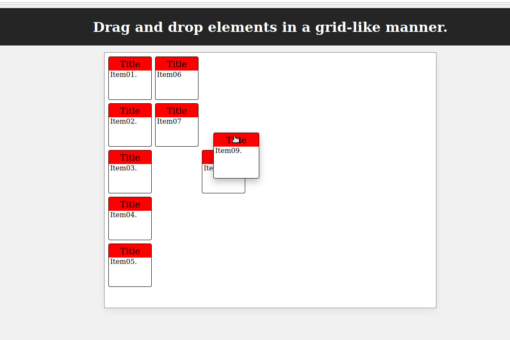

# Drag and drop HTML elements in a grid-like manner.

Features: 
-Drag and drop HTML elements. 
-When dropped checks for collision. 
-Snaps into a grid-like position. 
-Accounts for scrolling when the grid container is placed below a lot of content on a page.

